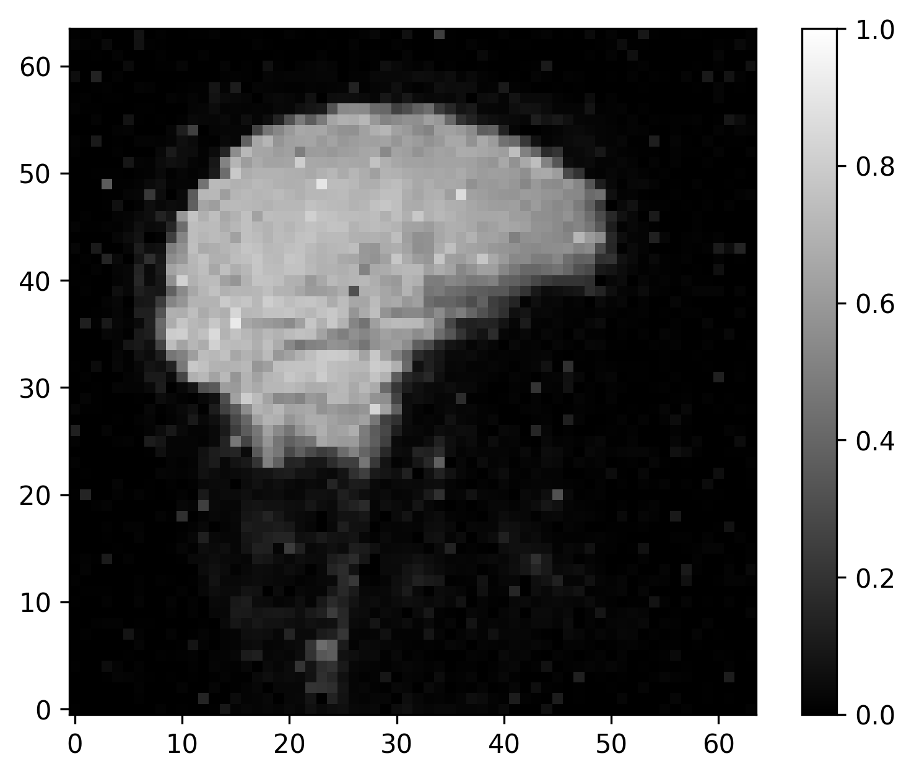
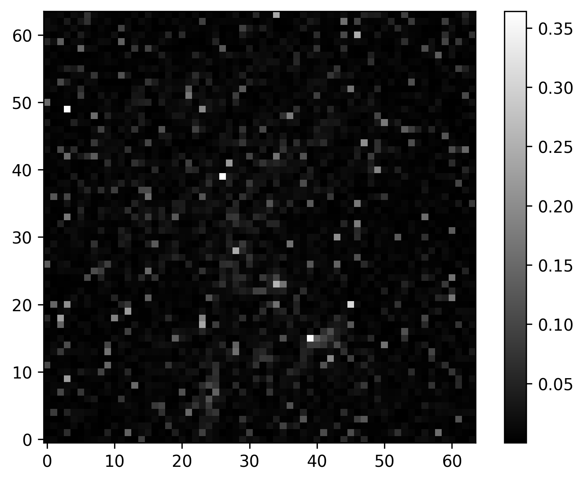

# Общее описание проекта

Проект: предсказание изменений fMRI-сигнала во времени по аудиодорожке фильма (MFCC-признаки) с учётом задержки BOLD-ответа и влияния предыдущих сканов.

### Постановка задачи

Требуется восстановить отображение:

**(аудиосигнал с задержкой Δt, предыдущие снимки) → текущий fMRI-срез**

с учётом запаздывания BOLD-ответа.

Зачем это нужно:

- исследовать связь между акустическими признаками звука и нейронной активностью, измеренной с помощью fMRI;
- проверить, насколько простая линейная модель + MFCC успевают «объяснить» изменения BOLD-сигнала;
- подобрать оптимальную задержку Δt между стимулом и откликом и посмотреть, в каких областях мозга аудиосигнал даёт наибольший вклад;
- в перспективе — улучшать методы неинвазивной «чтения» речи по мозговой активности и создавать простые диагностические/исследовательские инструменты для когнитивной нейронауки.

### Формат входных и выходных данных

#### Вход

- Аудиофайл фильма (длительность **390 с**)
- Параметры подготовки данных: **Δt** (задержка), а также параметры фичей (например, число MFCC)

#### Выход

- Предсказанные значения (воксели/признаки fMRI) во времени
- Предсказанные **разности** между соседними fMRI-кадрами

### Метрики

- Основная метрика — Mean Squared Error (MSE) между истинными и предсказанными значениями вокселей на тестовой выборке. Ожидаем получить результаты порядка $10^{-5}$. Ожидания основаны на : типичных амплитудах BOLD-ответа (1–2 % сигнала), что простые линейные encoding-модели в fMRI обычно объясняют ограниченную долю дисперсии сигнала (R² в пределах 5–20 % для лучших вокселей).

- Также планируется добавить зависимость MSE от задержки Δt. Ожидаем такие же результаты как и в первом пункте при подборе оптимальной задержки.

- Также планируется опционально вычислить корреляцию Пирсона.Ожидаемые значения корреляции Пирсона между истинным и предсказанным сигналом в слуховой коре лежат в диапазоне r ≈ 0.05–0.1 в среднем по ROI и до r ≈ 0.1–0.2 для наилучших вокселей, что сопоставимо с результатами линейных encoding-моделей для естественной речи на акустических признаках в современной литературе.

### Валидация и тест

Схема валидации, согласующаяся с постановкой задачи:
для каждого участника его временной ряд по fMRI и аудиопризнакам делится по времени на обучающую и тестовую части (без перемешивания, чтобы сохранить причинность);

- на обучающей части подбираются веса линейной регрессии и оптимальный гиперпараметр Δt (минимизация MSE);
- на тестовой части считаем итоговый MSE и строим визуализации (срезы с ground truth, предсказанием и разностью).

Чтобы сделать процедуру воспроизводимой в коде проекта, достаточно:

- фиксировать правило разбиения по времени
- не использовать случайное перемешивание

### Датасет

В работе используется датасет [Open multimodal iEEG-fMRI dataset from naturalistic stimulation with a short audiovisual film](https://www.nature.com/articles/s41597-022-01173-0)

- **Всего 30 участников** с fMRI-данными.
- **У каждого участника 641 fMRI-снимок**.
- fMRI:
  - частота сканирования **μ ≈ 1.64 Гц**
  - размерность объёма **40×64×64**
  - значения нормированы в **[0,1]**
- аудио:
  - частота дискретизации **44.1 кГц**
  - исходные значения в **[-1,1]**
  - из аудио извлекаются **MFCC**

## Моделирование

### Бейзлайн

- Наивная константная модель / копирование предыдущего среза
- Линейная регрессия без подбора Δt

### Основная модель

Сейчас в проекте используется **MLP-регрессор (PyTorch Lightning)**

Архитектура:

- Вход: вектор признаков размерности `input_dim` (формируется даталоадером из MFCC + контекста/сдвигов)
- Далее несколько скрытых слоёв:
  - `Linear → ReLU → (Dropout)` повторяется для каждого размера в `hidden_dims`
- Выход: `Linear` в размерность `output_dim` (предсказываются значения/приращения fMRI-признаков)

Оптимизация:

- loss: MSE
- optimizer: **AdamW** (`lr`, `weight_decay`)
- логируются `train_MSE`, `val_MSE`, `val_Pearson`

### Внедрение

В проекте реализован полный пайплайн:

### 1) Подготовка данных

- Загрузка данных через DVC
- Извлечение MFCC-признаков из аудио
- Формирование датасета/батчей через `AudioFmriDataModule`

### 2) Обучение и подбор `dt`

- Во время обучения подбирается/фиксируется `dt`, а **лучший `dt` сохраняется в `best_dt.txt`**
- Этот `dt` используется при формировании входов для инференса

### 3) Экспорт модели в ONNX и раскладка под Triton

- Скрипт `create_onnx.py`:
  - экспортирует `model.onnx` в папку версии `triton_models/<model_name>/<version>/model.onnx`

### 4) Инференс через Triton

- Скрипт `infer_triton.py`:
  - формирует батчи входов так же, как на обучении
  - отправляет их в Triton (`model_name`, `model_version`)
  - подтягивает `dt` из `triton_models/<model_name>/<version>/best_dt.txt`
  - выполняет постобработку (восстановление `Y` из `delta`, если `target.delta=true`)
  - сохраняет `y_test_full.npy`, `y_test_pred.npy`, `mse_test.txt` (+ `dt_used.txt`)
  - опционально строит визуализации через `Visualizer`

---

# Quick start

## Setup

Клонирование репозитория:

```
git clone <REPO_URL>
```

Устанавливаем uv

```
brew install uv
```

Устанавливаем зависимости по uv.lock

```
uv sync
```

## Train

На данном этапе последовательно производятся следующие действия при запуске train:
- Если данные ещё не скачаны, то происзводится скачивание dvc данных и их преобразование в обычный формат;
- Далее происходит предобработка данных и формирование пар фМРТ - аудио, формируется обучающая и тестовая выборки;
- После этого происходит обучение;

В данноим проекте вам не нужно запускать первые 2 пункта отдельно, они запускаются автоматически при вызове train.

Запускаем mlflow

```
mlflow server --host 127.0.0.1 --port 8080
```

Добавляем ключ для скачивания данных

```
export YANDEX_WEBDAV_TOKEN=<токен>
```
Перед обучением вы может опционально изменить гиперпараметры обучения в папке `configs`:
- основной файл для запуска `train`: `configs\train.yaml` (является собирающим файлом)
- основной файл для изменения параметров обучения(эпохи, размер батча, директория сохранения лучшей модели и т.д.): `configs/train_cfg/default.yaml`
- изменение параметров для сохранения лучшей модели:  `configs\checkpoint\default.yaml`
- изменение параметров данных: `configs\data\default.yaml`
- изменение парметров загрузки dvc : `configs/dvc/yandex_webdav.yaml`
- изменение параметров mlflow: `configs/mlflow/default.yaml`
- изменение параметров обучаемой модели: `configs/model/mlp.yaml`
- изменение параметров оптимизатора: `configs/optim/adamw.yaml`
- изменение директории сохранения графиков: `configs/plots/default.yaml`
- изменение парметров обработки аудио: `configs/preprocess/audio/default.yaml`
- изменение парметров обработки фМРТ: `configs/preprocess/fmri/default.yaml`
- изменеие параметров составления пар фМРТ-аудио: `configs/preprocess/pairs/dt_search_4_8.yaml`
- изменение разбиения на тест и обучение: `configs/split/default.yaml`
- изменение формата выходных данных модели: `configs/target/delta.yaml`

Запускаем обучение на определённом паиценте:

```
uv run python -m scripts.train data.subject_id=09
```
Во время обучения графики будут высвечиваться под названием, например, `sub09_dt4`, где 09 - номер пациента, dt4 - гиперпараметр задержки BOLD 4 секунды (во время обучения идёт подбор этого гиперпараметра от 4 до 8 секунд, поэтому всегда для каждого пациента у вас будет 5 разных вкладок в mlflow)

После обучения все графики и логи будут сохранены автоматически в папке plots, лучшая модель будет сохранена по пути `artifacts/best.ckpt`, а лучший гиперпарамтр dt:`artifacts/best_dt.txt`

**Важно 1**: модель всегда обучается только на одном пациенте, список доступных пациентов(data.subject_id) пока что: `[04", "07", "08", "09", "11", "13", "14", "15", "16", "18", "22", "24", "27", "28", "29"]`

**Важно 2**: данные весят достаточно много - порядка 10 Гб, поэтому при первом запуске train нужно набраться терпения и подождать минут 30-40, пока всё не загрузится

## Production preparation

В данном проекте есть опция делать инференс c помощью Trion Inference Server и без него, если вы хотите использовать Trion Inference Server, то необходимо сначала перевести модель в формат Onnx и сохранить в нужной директории:

```
uv run python -m scripts.create_onnx onnx.model_version=1
```

в качестве `onnx.model_version` можно использовать любой номер

Для изменения параметров сохранения модели(директории, папки, где хранится лучшая модель и т.д.) можете воспользоваться `configs/create_onnx.yaml`

Если же вы не хотите делать инференс через Trion Inference Server, то ничего делать не надо.

## Infer

- Добавляем ключ для скачивания данных

```
export YANDEX_WEBDAV_TOKEN=<токен>
```

- Через Trion Inference Server
  - запускаем сервер с сохранёнными моделями
    ```
    docker run --rm \
    -p8000:8000 -p8001:8001 -p8002:8002 \
    -v $(pwd)/triton_models:/models \
    nvcr.io/nvidia/tritonserver:24.10-py3 \
    tritonserver --model-repository=/models
    ```
  - опцианально можно изменить параметры инференса: используя основной конфиг сборки: `configs/infer_triton.yaml`, основой конфиг инференса: `configs/infer_triton_cfg/default.yaml`, конфиг сервера: `configs/triton_server/default.yaml`, а также другие конфиги, которые были описаны в разделе Train
    
  - запускаем инференс

    ```
    uv run python -m scripts.infer_triton data.subject_id=09 triton_server.model_version=5
    ```

    в качестве `triton_server.model_version` указываете версию той модели, которую хотите использовать

    в качестве `data.subject_id` указываете номер участника, которого хотите запустить на инференсе, список доступных пациентов(data.subject_id) пока что: `[04", "07", "08", "09", "11", "13", "14", "15", "16", "18", "22", "24", "27", "28", "29"]`

- Без Trion Inference Server
  опцианально можно изменить параметры инференса: используя основной конфиг сборки: `configs/infer.yaml`, основой конфиг инференса: `configs/infer_cfg/default.yaml`, которые были описаны в разделе Train
  
  ```
  uv run python -m scripts.infer data.subject_id=09
  ```

  Будет запускаться последняя обученная модель

### Формат данных 
На вход модели подаются данные в таком же формате, что и в train - пары фМРТ-аудио, на выходе модель предсказывает фМРТ изображение:
Будут высвечиваться 3 картинки в следующем порядке: исходная, предсказанная, разница между исходной и предсказанной.
### Пример:
## Исходная

## Предсказанная

## Разница


